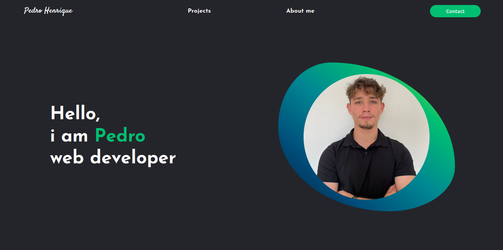

# Meu Portfólio de Desenvolvimento Web

Este é meu portfólio de desenvolvimento web, onde apresento alguns dos projetos nos quais trabalhei e as tecnologias que utilizo. É uma vitrine do meu trabalho, mostrando minhas habilidades em front-end, back-end e design responsivo.

## Demonstração ao Vivo
Veja o portfólio em ação [aqui](https://meuportfolio.com). TODO

## Capturas de Tela



## Funcionalidades
- Seção de apresentação pessoal.
- Galeria de projetos com links para o GitHub. TODO
- Formulário de contato funcional. TODO
- Responsividade para diferentes dispositivos.
- Modo claro/escuro. TODO

## Tecnologias Utilizadas
- React.js
- JavaScript (ES6+)
- Vite
- React Router (para navegação) TODO

## Instalação

Siga os passos abaixo para rodar o projeto localmente:

1. Clone o repositório:

    ```bash
    git clone https://github.com/PedroDiOliveira/web-portfolio.git
    ```

2. Instale as dependências:

    ```bash
    cd web-portfolio
    npm install
    ```

3. Inicie o servidor de desenvolvimento:

    ```bash
    npm run dev
    ```